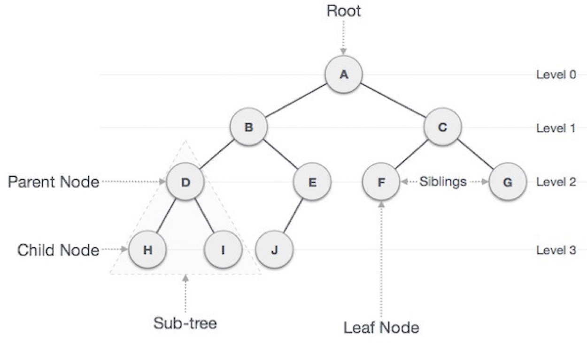
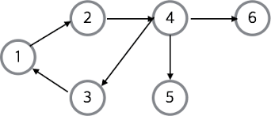
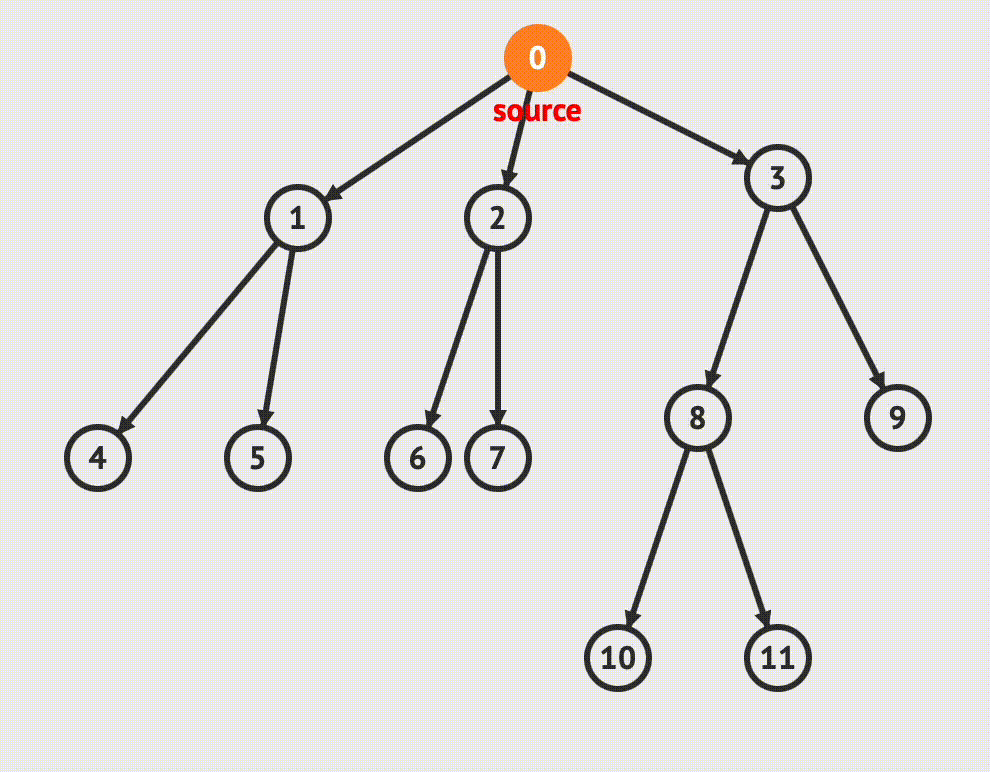
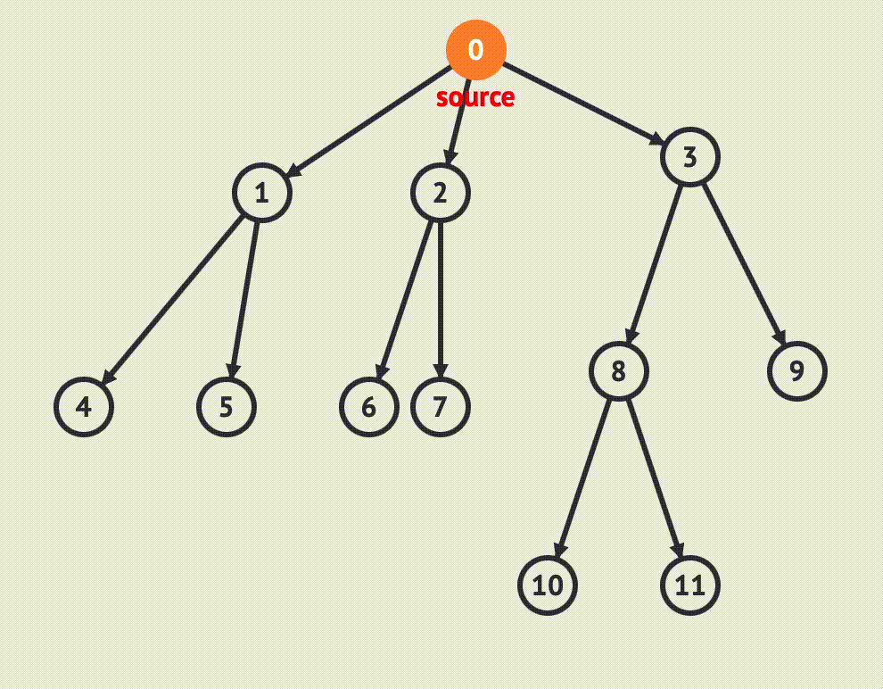

# DFS & BFS Algorithm

## 트리와 그래프

트리와 그래프는 유사한 부분이 많지만, 차이점이 있는 서로 다른 자료구조이다.

트리와 그래프는 비선형구조이다.

BFS와 DFS는 그래프를 탐색하는 방법이다.

그 전에 트리와 그래프의 차이점을 배워보자

<br>

### 트리 (Tree)

트리는 정점(Node)와 선분(Branch)을 이용하여 사이클이 이루어지지 않게 구성된 자료구조이다.

<br>

#### 이미지



<br>

#### 특징

* 트리는 계층 모델이다.
* 트리는 비순환 그래프이다.
* 노드가 N개인 트리는 항상 N-1 개의 간선을 가진다.
* 순회는 Pre-order, In-order, Post-order로 이루어진다.
* 트리는 이진트리, 이진 탐색 트리, 균형 트리, 이진 힙 등이 있다.

<br>

#### 트리의 용어

- 루트 노드(root node) : 부모가 없는 노드, 트리는 하나의 루트 노드 만을 가진다.
- 단말 노드(leaf node) : 자식이 없는 노드
- 내부(internal) 노드 : 단말 노드가 아닌 노드
- 간선(edge) : 노드를 연결하는 선
- 형제(sibling) : 같은 부모를 가지는 노드
- 조상 노드(ancestors node) : 임의의 노드에서 루트 노드에 이르는 경로상에 있는 노드들 (D의 조상은 B, A이다) 
- 노드의 크기(size) : 자신을 포함한 모든 자손 노드의 개수
- 노드의 깊이(depth) : 루트에서 어떤 노드에 도달하기 위해 커쳐야하는 간선 수
- 노드의 레벨(level) : 트리의 특정 깊이를 가지는 노드의 집합
- 노드의 차수(degree) : 각 노드에서 뻗어나온 가지의 수 (D의 차수는 2이다.)
- 트리의 차수(degree of tree) : 트리에서 가장 큰 차수 
- 트리의 높이(height) : 가장 깊숙히 있는 노드의 깊이 (3)

<br>

### 그래프 (Graph)

노드와 노드를 연결하는 간선들로 구성된 자료구조

<br>

#### 이미지



<br>

#### 그래프의 특징

- 네트워크 모델이다.
- 노드들 사이에 방향/무방향 경로를 가질 수 있다.
- 순환 혹은 비순환이다.
- 크게 방향 그래프와 무방향 그래프가있다.

<br>

#### 그래프의 용어

- 정점(vertext) : 위치라는 개념
- 간선(edge) : 정점을 연결하는 선
- 인접 정점(adjacent vertex) : 간선에 직접 연결된 정점
- 차수(degree) : 한 정점에 연결된 간선의 수 (주로 무방향 그래프에서 사용)
- 입력 차수(in-degree) : 한 정점으로 들어오는 간선의 수 (주로 방향그래프에서 사용)
- 출력 차수(out-degree) : 한 정점에서 나가는 간선의 수(주로 방향그래프에서 사용)
- 사이클(cycle) : 한 정점에서 출발하여 시작했던 정점으로 돌아오는 경로
- 가중치 그래프 : 간선마다 가중치 값이 매겨져있는 그래프

<br>

#### 그래프의 종류

* 무방향 그래프 (Undirected Graph)
  * 간선을 통해 양방향으로 갈 수 있다.
  * 정점 A와 정점 B를 연결하는 간선은 (A,B), (B,A) 이다.
* 방향 그래프 (Directed Graph)
  * 간선에 방향성이 존재하는 그래프
  * A -> B로 갈 수 있는 간선은 (A, B)로 표시한다.
* 가중치 그래프 (Weighted Graph)
  * 간선을 이동하는데 비용이나 가중치가 할당된 그래프
  * 네트워크라고도 한다.

<br>

<br>

---

### DFS (Depth First Search) - 깊이 우선 탐색

그래프에서 최대한 깊이 내려간 뒤, 더이상 깊이 갈 곳이 없을 경우 되돌아와 다음 깊이를 탐색한다.

DFS는 완전 탐색으로 그래프의 모든 노드들을 탐색하게 된다.

<br>

#### 이미지



<br>

#### 구현

일반적으로 스택을 이용하여 구현한다.

스택 외에도 재귀함수를 이용하여 구현할 수 있다.

```python
# 스택을 이용한 구현

def dfs_func(start):
    stack = [start]													# 스택에 첫 시작 노드 값을 넣어준다
    visited = [False for _ in range(n+1)] 	# 노드의 방문 여부를 담을 리스트
    
    while stack:														# 앞으로 방문할곳이 없다면 반복 종료
        node = stack.pop()
        if not visited[node]:								# 해당 노드를 방문한적이 없으면
            visited[node] = True						# 방문했다고 값 변경
            stack.extend(linked[node])			# 해당 노드가 다음으로 갈수있는 노드를 스택에 추가
    
# n, start, linked - 각 노드의 갯수, 시작 노드, 노드간의 연결 내용
```

```python
# 재귀를 이용한 구현

def dfs_func(start):
    if not visited[start]:								# 방문한적이 없으면 실행
        visited[start] = True							# 방문으로 변경

        for node in linked[start]:				# 다음 방문할 노드들을 인자로 하여 재귀 호출
            func(node)
```

```python
# 재귀를 이용한 구현2
# 함수 호출이 적어 메모리나 수행 시간에서 위에것보다 우위에 있을것으로 예상됨

def dfs_func(start):
    visited[start] = True
    
    for node in linked[start]:						# 다음 노드를 방문했었다면 호출 안함
        if not visited[node]:
            dfs_func(node)
```

<br>

### BFS (Breath First Search) - 너비 우선 탐색

그래프에서 다음 레벨의 모든 노드를 방문하고, 더 이상 방문할 노드가 없으면 다음 레벨의 노드들을 방문한다.

<br>

#### 이미지



<br>

#### 구현

BFS 는 큐를 이용하여 구현한다.

```python
# 큐를 이용한 구현

from collections import deque

def bfs_func(start):
    queue = deque([start])								# collections 모듈에서 deque 메서드를 이용하여 dequeue 를 사용
    visited = [False for _ in range(n+1)]		# 방문 여부를 담는 리스트 변수
    
    while queue:														# 다음으로 진행할 노드가 있을때까지 반복
      node = queue.popleft()								# 맨 먼저 들어간 노드를 꺼내온다
      if not visited[node]:									# 방문하지 않았으면
          visited[node] = True							# 방문으로 값 변경
          queue.extend(linked[node])				# 다음으로 이동할 노드들을 dequeue에 추가
```

<br>

### DFS 와 BFS의 비교 및 장단점

DFS와 BFS는 모두 비선형 자료구조인 그래프의 탐색방법으로 기본적으로 완전탐색의 일종이다.

완전탐색이므로 모든 노드들을 방문하게 되는데, 찾고자 하는 경우가 중간에 발견되는 경우 탐색을 마칠수있다.

| DFS                                                          | BFS                                                          |
| :----------------------------------------------------------- | ------------------------------------------------------------ |
| 현재 정점에서 갈 수 있는 점들까지 들어가면서 탐색<br />(한쪽 노드에서 내려갈수있는 최고 깊이의 레벨까지 우선적으로 내려간다) | 현재 정점에 연결된 가까운 점들부터 탐색<br />현재 노드의 아래 레벨의 모든 노드들을 탐색하고 그 다음 레벨의 노드들을 탐색하게 된다. |
| 스택 또는 재귀함수로 구현                                    | 큐를 이용해서 구현                                           |
| 1. 모든 노드를 방문하고자 할때 DFS 이용<br />2. BFS 보다 조금 더 단순함<br />3. 검색 속도는 BFS에 비해 느림 | 1. 출발 노드와 찾고자 하는 노드의 최단 경로를 찾고 싶을때 사용 |

<br>

##### 시간 복잡도

두 방식 모두 조건 내의 모든 노드를 검색한다는 점에서 시간 복잡도는 동일하다.

N은 노드, E는 간선일때

> 인접 리스트 : O(N+E)
>
> 인접 행렬 : O(N^2)

일반적으로 E(간선)의 크기가 N^2에 비해 상대적으로 적기 때문에 인접 리스트 방식이 효율적

<br>

---

## 참고

그래프와 트리 : https://bamdule.tistory.com/68

DFS_BFS : https://devuna.tistory.com/32