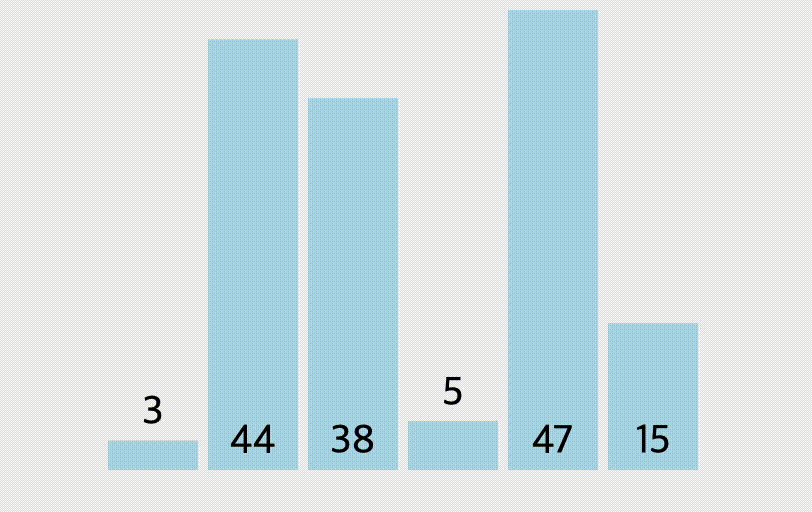
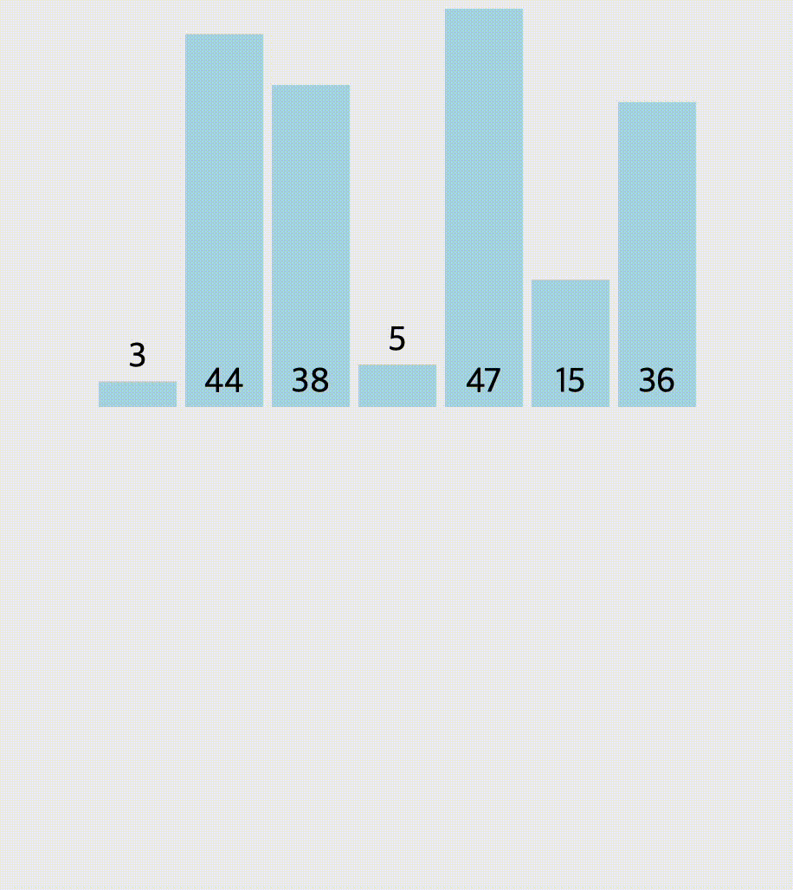
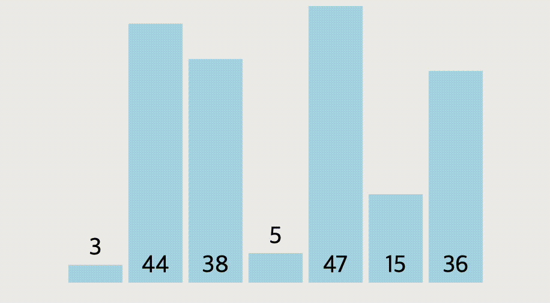
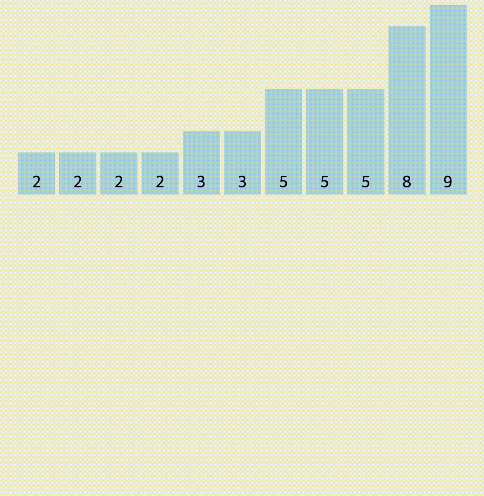

# Sort Algorithm (정렬 알고리즘)

## 종류

* [선택 정렬 (Selection Sort)](#선택-정렬-(selection-sort))
* [삽입 정렬 (Insertion Sort)](#삽입-정렬-(insertion-sort))
* [버블 정렬 (Bubble Sort)](#버블-정렬-(bubble-sort))
* [카운팅 정렬 (Counting Sort)](#카운팅-정렬-(counting-sort))
* [퀵 정렬 (Quick Sort)](#퀵-정렬-(quick-sort))

 <br>

---

### 선택 정렬 (Selection Sort)

`선택 정렬`은 `제자리 비교 정렬`이다. 복잡도는 `O(n^2)`이므로 큰 리스트에는 비효율적이며, 유사한 삽입 정렬보다 성능이 더 떨어지는 것이 일반적이다. 선택 정렬은 단순함이 특징이며 특정한 상황에서는 더 복잡한 알고리즘보다 성능상 우위가 있다.

 <br>

* 로직

  

  1. 정렬 되지 않은 인덱스의 맨 앞에서부터 이를 포함한 그 이후의 배열값 중 가장 작은 값을 찾아간다.
  2. 가장 작은 값을 찾으면, 그 값을 현재 인덱스의 값과 바꾼다
  3. 반복

 <br>

* 시간복잡도

  O(n^2)

 <br>

* 안정성

  불안정

 <br>

* 구현

  ```python
  num_list = [3, 5, 4, 6, 1, 2, 7]
  
  for i in range(len(num_list)-1):
      min_idx = i
      for j in range(i+1, len(num_list)):
          if num_list[i] > num_list[j]:
              min_idx = j
      num_list[i], num_list[min_idx] = num_list[min_idx], num_list[i]
  ```

 <br>

---

### 삽입 정렬 (Insertion Sort)

`삽입 정렬`은 작은 리스트와 대부분 정렬된 리스트에 상대적으로 효율적인 단순한 정렬 알고리즘이며 더 복잡한 알고리즘의 일부분으로 사용되기도 한다.

리스트로부터 요소를 하나씩 취한 다음 마치 돈을 지갑에 넣는 방식과 비슷하게 이들을 올바른 위치에, 새로 정렬된 리스트에 삽입함으로써 동작한다.

배열의 경우 새 리스트와 남아있는 요소들은 배열 공간을 공유할 수 있으나 삽입의 경우 잇따르는 모든 요소를 하나씩 이동해야 하므로 비용이 많이 든다.

`셸소트`는 큰 리스트에 더 효율적인 삽입 정렬의 변종이다.

 <br>

* 로직

  

  1. 삽입정렬은 두번째 인덱스부터 시작함. 현재 인덱스는 별도의 변수에 저장해주고, 비교 인덱스를 현재 인덱스-1 로 설정한다.
  2. 별도로 저장해 둔 삽입을 위한 변수와 비교 인덱스의 배열 값을 비교
  3. 삽입 변수의 값이 더 작으면 현재 인덱스로 비교 인덱스 값 저장해주고, 비교 인덱스를 -1하여 비교를 반복
  4. 만약 삽입 변수가 더 크면 비교 인덱스 +1에 삽입 변수를 저장

 <br>

* 시간복잡도

  O(n^2)

 <br>

* 안정성

  안정

 <br>

* 구현

```python
num_list = [0, 3, 5, 4, 6, 7, 1, 2]

#1.
for i in range(1, len(num_list)):
    value = num_list[i]
    j = i-1
    while num_list[j] > value and j >= 0:
        num_list[j+1] = num_list[j]
        j -= 1
    num_list[j+1] = value
    
#2. 거품 정렬 개념과 살짝 섞임
for i in range(1, len(num_list)):
    for j in range(i, 0, -1):
        if num_list[j] < num_list[j-1]:
            num_list[j], num_list[j-1] = num_list[j-1], num_list[j]
        else:
            break
```

  <br>

---

### 버블 정렬 (Bubble Sort)

거품 정렬은 두 인접한 원소를 검사하여 정렬하는 방식이다. 시간 복잡도가 O(n^2)로 상당히 느리지만, 코드가 단순하기 때문에 자주 사용된다. 양방향으로 번갈아 수행하면 칵테일 정렬이 된다.

 <br>

* 로직

  

  1. 두개의 인덱스가 하나의 쌍이 되어 움직인다. 현재 인덱스 값과 바로 이전의 인덱스 값을 비교한다.
  2. 만약 이전 인덱스가 더 크면, 현재 인덱스와 바꿔준다.
  3. 현재 인덱스가 더 크면, 교환하지 않고 다음 두 연속된 배열값을 비교한다.
  4. 이를 (전체 배열의 크기 - 현재 순환한 바퀴 수)만큼 반복한다.

<br>

* 시간복잡도

  O(n^2)

 <br>

* 안정성

  안정

 <br>

* 구현

```python
num_list = [0, 3, 5, 4, 6, 7, 1, 2]
length = len(num_list) - 1

for i in range(length):
    for j in range(length-i):
        if num_list[j] > num_list[j+1]:
            num_list[j], num_list[j+1] = num_list[j+1], num_list[j]
```

<br>

---

### 카운팅 정렬 (Counting Sort)

정렬을 진행할 리스트에서 각 요소의 값들이 몇번씩 나왔는지 카운팅하여 정렬하는 방식

<br>

* 로직

  

<br>

* 시간복잡도

  O(n+k)

<br>

* 안정성

  불안정

<br>

* 구현

  ```python
  def counting_sort(li):
      sorted_list = [0] * len(li)                     # 정렬된 리스트를 담을 변수
      max_value = li[0]                               # 리스트에서 최고값을 찾음
      min_value = li[0]                               # 리스트에서 최솟값을 찾음
  
      for n in li:
          if max_value < n:
              max_value = n
          elif min_value > n:
              min_value = n
  
      cnt_list = [0] * (max_value + 1 - min_value)        # 리스트에서 최고값의 크기 + 1 리스트 생성
  
      for n in li:                                        # 해당 숫자의 갯수를 세어서 리스트에 저장
          cnt_list[n - min_value] += 1
  
      for idx in range(1, len(cnt_list)):                 # 누적합으로 저장
          cnt_list[idx] = cnt_list[idx-1] + cnt_list[idx]
  
      for n in li:                                        # 새로운 리스트에 정렬된 리스트 저장
          sorted_list[cnt_list[n-min_value]-1] = n
          cnt_list[n-min_value] -= 1
  
      return sorted_list
  ```

<br>

---

### 퀵 정렬 (Quick Sort)

<br>

---

## 참고

* [위키백과 정렬 알고리즘](https://ko.wikipedia.org/wiki/정렬_알고리즘#제자리_정렬)
* [블로그1](https://reakwon.tistory.com/37)
* [블로그2](https://hsp1116.tistory.com/33)
* [블로그3](https://evan-moon.github.io/2018/10/13/sort-algorithm/)
* [블로그4](https://roka88.dev/98)

