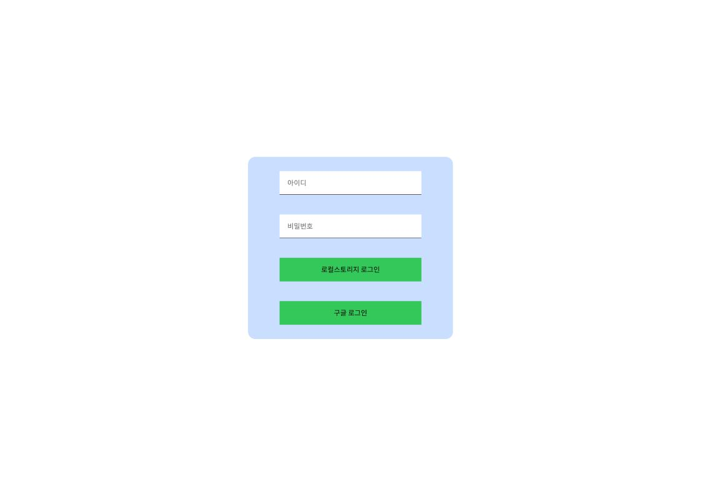
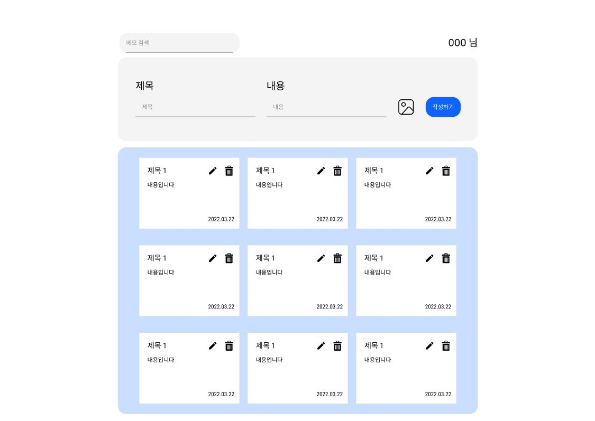
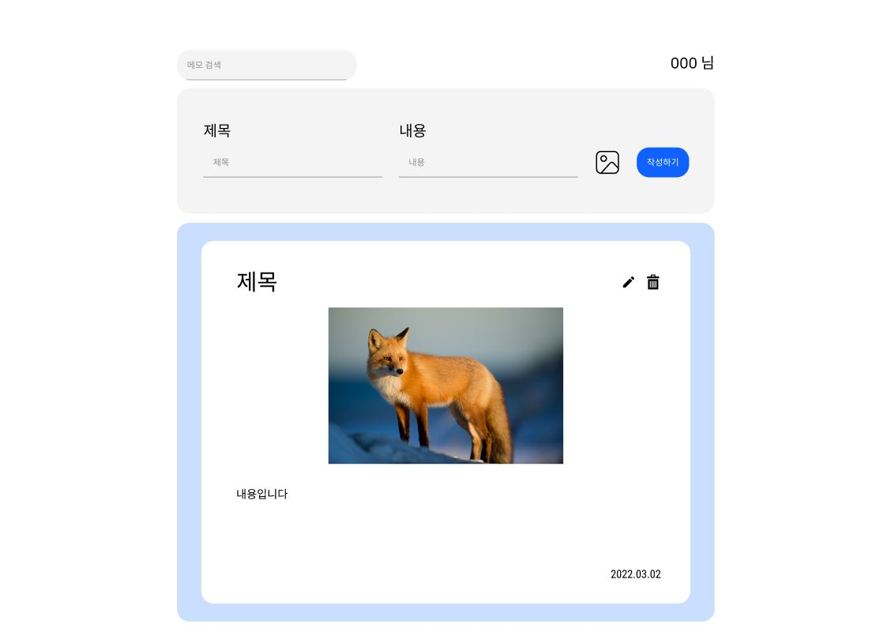

# MemoSite

## 개요

메모를 저장하고, 확인, 수정, 삭제 가능한 간단한 웹페이지

## 목표 학습 내용

- 페이지 구성 관련

  - 레이아웃 구성

  - 컴포넌트 단위 개발

  - 페이지 라우팅 (동적 라우팅)

- 상태 관리 관련

  - API 통신 이용한 상태 갱신

  - Firebase Database 연결

  - Local Storage 이용

  - 전역 상태 관리

- 성능

  - 디바운싱 (메모 검색시 이벤트 처리)

  - 쓰로틀링 (메모 목록 스크롤시 이벤트 처리)

## 와이어프레임

1. 로그인 페이지 (초기 페이지)

    

2. 메모 목록 페이지

    

3. 메모 상세 페이지

    

## 사용한 스킬 목록

1. Next (제작 중)
